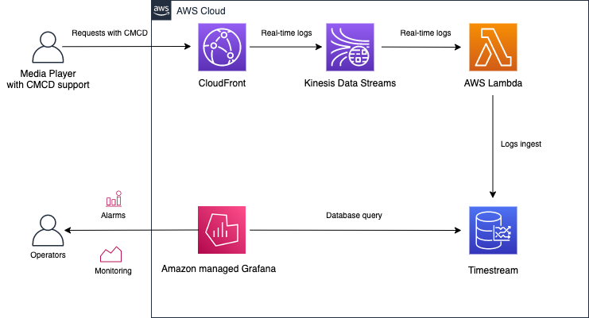
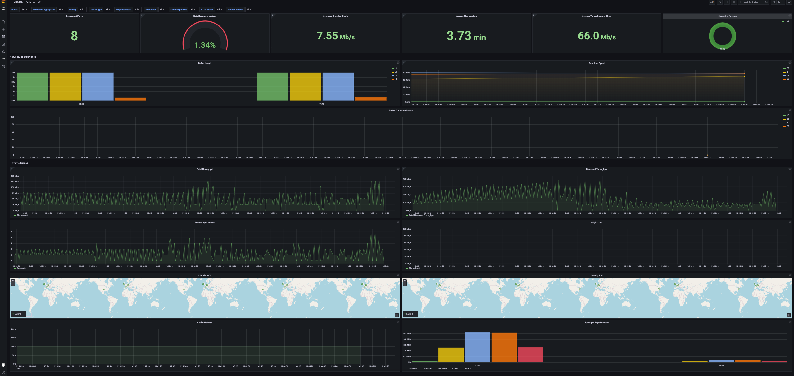

# Solution description

This repository offers a demonstration of leveraging Common Media Client Data (**CMCD**) in conjunction with Amazon CloudFront, Amazon Timestream, and Amazon Managed Grafana. 
Upon installation, it sets up a dashboard complete with predefined widgets, constructed from CloudFront logs enriched with CMCD metrics. 
Additionally, it provisions multiple media player clients to generate data for the dashboard



## Provisioned components

- An HLS video asset hosted on S3.
- A web page hosting open source [HLS.js](https://github.com/video-dev/hls.js/) media player configured to play the video asset.
- Several [LightSail](https://aws.amazon.com/lightsail) instances deployed across various AWS regions, emulating Mobile, Desktop, and Smart TV clients. These instances continuously run a Python script, opening the web page and initiating playback. One instance in France is bandwidth-throttled to 500 Kbps to simulate rebuffering events.
- CloudFront distribution with Real-time logs that is used by clients to watch the video.
- Kinesis Data Stream to send CloudFront logs to.
- Lambda function to parse the logs and insert them into Amazon Timestream.
- Grafana to be used for logs visualisation/dashboarding.

Since we are deploying 5 minutes long HLS video asset it takes several minutes to clone the solution and to install it.

There are two dashboards:
- "QoE" dashboard provides visualisation of most common video metrics: rebuffering, number of concurrent plays, average play duration and others.

- "Troubleshooting" provides charts that are useful to find the root cause of rebuffering.

Both dashboards provide Variables that can be used to filter in/out the data using various dimensions, e.g. Country, Device Type, Distribution, Streaming format etc.

## Prerequisites 
- Terrafrom 1.1.9+
- A user in [AWS Identity and Access Management](https://aws.amazon.com/iam/identity-center/) and the [organizational unit](https://aws.amazon.com/organizations/) to be used for administrating Grafana dashboard 
- AWS CLI

## Solution deployment
1. Choose AWS profile to be used to deploy solution, for example:

`export AWS_PROFILE=CMCD-demo`

2. Zip Lambda function

`cd lambda && zip -r cmcd-log-processor.zip cmcd-log-processor.py && cd ..`

3. Init Terraform

`terraform init`

4. Deploy the solution:

```shell
terraform apply \
  -var="deploy-to-region=<AWS_REGION>" \
  -var="grafana_sso_organizational_units=<AWS_ORG_UNIT_ID>" \
  -var="grafana_sso_admin_user_id=<ADMIN_USER_ID>" \
  -var="solution_prefix=<SOLUTION_PREFIX>"
```

- `deploy-to-region`:  Specifies the AWS region where the solution will be deployed. Ensure that this region supports both Amazon Timestream and Grafana services.
- `grafana_sso_organizational_units`: Specifies the AWS Organizational Unit ID to be used for Grafana Single Sign-On (SSO) authentication.
- `grafana_sso_admin_user_id`: Specifies the user ID to be designated as the Grafana administrator.
- `solution_prefix`:  Provides a unique prefix that will be appended to resource names created by the solution.

**Note:** If you encounter the error message:
```
Error: InvalidInputException: Sorry, your account can not create an instance using this Lightsail plan size. Please try a smaller plan size or contact Customer Support if you need to use a larger plan.
```
You can resolve it by re-running the `terraform apply` command. 
This error typically occurs when the Lightsail instance plan size is not compatible with your account settings. 
By re-running the command, Terraform will attempt to deploy the instances again, and it may succeed on subsequent attempts.

## Install the dashboard
### Install the Amazon Timestream plugin in Amazon Grafana 9.4:
* Open Grafana using the provided Grafana workspace URL.
* Navigate to "Apps" -> "AWS Data Source". 
* Select "Install now" for Timestream.
* Click "Install".

### Configure Amazon Timestream datasource:
* Navigate to "Administration" -> "Data Sources".  
* Click "Add data source".
* Select "Amazon Timestream".

**Note:** If you encounter the error message:
```
Fetch error: 404 Not Found Instantiating ...
```
This indicates that the plugin installation has not yet been propagated across all Amazon Grafana servers. 
In such cases, it's advisable to wait several more minutes before proceeding to the next step.

* Choose the region used for provisioning as the "Default Region".
* Select "cmcd-db" as the "Database".
* Select "cmcd-table" as "Table".
* Select "MULTI" as "Measure". 
* Click "Save and test".

### Upload CMCD dashboards:

* Navigate to "Dashboards".
* Select "New"-> "Import".
* Select "Upload dashboard JSON file".
* Select a dashboard from [dashboards](./dashboards)

## De-provisioning
```shell
terraform destroy \
  -var="deploy-to-region=<AWS_REGION>" \
  -var="grafana_sso_organizational_units=<AWS_ORG_UNIT_ID>" \
  -var="grafana_sso_admin_user_id=<ADMIN_USER_ID>" \
  -var="solution_prefix=<SOLUTION_PREFIX>"
```

## Dashboard walk-through.
By default, the dashboard is not refreshed automatically. It helps to minimize numbers of queries to Timestream when it is not needed and hence - its cost.
The dashboard can be refreshed by clicking  **Refresh Dashboard** in the top right hand menu or set to be refreshed automatically in the same menu.
Change Time picker in the same menu from *Last 30 minutes* to another time interval.

### QoE dashboard
1. This dashboard is intended to show QoE and traffic metrics.There are two sections (rows) - **Quality of experience** and **Traffic figures**. They can be minimized to help focus on other data. 
2. **Concurrent Plays**  is estimated by counting the number of unique video session id (CMCD *sid* parameter) for the time period specified in Time picker. It is not the same as unique viewers count: since it is only 5 minutes long video constantly played, the same client can finish and start multiple different plays within the time period.
3. **Rebuffering percentage** is calculated as percentage of requests signalling rebuffering (CMCD **bs**) to the total number of requests.
4. **Average Encoded Bitrate** and **Average Measured Throughput** are calculated using average values of CMCD *br* and *mtp* respectively.
5. **Average Play duration** is the sum of media objects duration (CMCD *d*) downloaded during a video play. This is the duration of the actual content seen by the viewer. If some time was spent on rebuffering, the actual downloaded content duration would be less than overall playback duration.
6. **Buffer Length** and **Measured Throughput** use percentile aggregation controlled by **Percentiles aggregation** variable.
7. **Total Throughput** and **Total Measured Throughput** both provide the total throughput however they do this differently.
 **Total Throughput** is calculated using CloudFront *sc_bytes*, it is sum of bytes sent to the viewers divided by the time period. 
This way the traffic peaks are smoothed over period of time.
**Measured Throughput** is caclulated from CMCD parameter *mtp* which is a throughput measured by the media player. 
In this case, traffic peaks are not smoothed.
8. **Plays by GEO** map shows a number of concurrent sessions originated in a country. **Plays by PoP** shows a number of concurrent sessions terminated by a CloudFront PoP.

### Troubleshooting dashboard
1. This dashboard is intended to help find a root cause of rebuffering events.
**Rebuffering Events Count** and **Rebuffering Events Percentage** show how rebuffering change over time.
2. To aid on the root cause investigation, **Rebuffering Events Logs** shows excerpt from the logs of affected requests. Since Buffer starvation signal is carried in the request that follows the actual buffer startvation, we use *Lag* function to exract the data from the log record preceeding the *bs* signal. 
 It enables for more accurate issues tracing. The data retrieved from the logs includes CloudFront request ID required by CloudFront support for performance related tickets.
3. To understand whether rebuffering is caused by CDN or Origin, we use
fist byte latency values as measured by CloudFront:
   - *ttfb*, time to first byte, which is the number of seconds between CloudFront server receives the request and writes the first byte of the response to the underlying kernel TCP stack.There is no impact of external aspects on this value (such as network or the file size), therefore it can be used as an indication of a CDN server performance because in essence it is a measure of how fast CloudFront process the request and send the response. But only in the case of Cache Hit, because when the request is Cache Miss, CloudFront server needs to wait till the response from Origin arrived before submiting response. 
   - *origin-fbl*, Origin first-byte latency, which is the number of seconds of first-byte latency between CloudFront and your origin. if Orgin is overloaded, it might be slow in processing requests and first-byte latency will be impacted. 

   By using both TTFB for Cache Hit and Origin first-byte latency we can decide whether we need to focus investigation on CDN performance or on Origin, and if there is no evidence on their performance degradation, the troubleshooting focus can be switched on network or clients issues.
4. **Rebuffering Sessions vs  TTFB: HIT vs Origin FBL** merge Rebuffering ratio with *CloudFront time-to-first-byte* and *Origin first-byte latency* on the same chart to see if they are correlated. 
For example, if there is simultaneous spike for two metrics it can signal correlation. Rebuffering Ratio is measured differently than in QoE dashboard. It quantifies the ratio of video sessions that have more than 1% of rebuffering requests to the total number of requests within selected Interval. For example, if the video chunks duration is 4 seconds, buffer length is 30 seconds, the player sends approx. 82 requests during 5 minutes. Therefore, just 2 requests signalling rebuffering would be more than 1% of all requests making the session being counted as stalled/rebuffered. Rebuffering Ratio can be used to set up an alert when percentage of rebuffering video plays exceeds a certain threshold and the root cause analysis is required.

5. Sometimes, TTFB can vary significantly and still remain within acceptable values. For example, spike in TTFB from 10 ms to 20 ms is 100% increase but 20 ms is acceptable delay for the application to start delivering the first byte without causing performance issues. Therefore, it is important to pay attention to the actual values and not only on TTFB line volatility. To help we this, 
**Changeability of  TTFB: HIT** and **Changeability of  Origin FBL** that provide moving average that measures the trend as well as rate of change. This allows not to be misled by occasional spikes but rather see if there is an uptrend signalling issues.


## What is CMCD?
CMCD is a specification developed by WAVE (Web Application Video Ecosystem) project hosted by the Consumer Technology Association (CTA). It specifies how media players can convey QoE client-side metrics with each request, as a custom HTTP request header, as an HTTP query argument, or as a JSON object. CMCD specification containing full list of metrics can be found [here](https://cdn.cta.tech/cta/media/media/resources/standards/pdfs/cta-5004-final.pdf)

CMCD metrics enable customers to achieve various tasks, for example:

* **Session ID** (`sid`) identifies the current playback session and allows thousands of individual server log lines to be interpreted as a single user session and build reports on a session level. It can be also used for troubleshooting purposes: if there is a video session suffering from rebuffering, Session ID helps quickly find individual requests belonging to that session and provide them to Support for investigation.
* **Buffer starvation** (`bs`) signals that the player is in rebuffering state and the video or audio playback were stalled right before sending the request. It indicates an issue to be addressed. By checking corresponding server-side metrics we can verify operational health of CDN server and see whether the issue is related to the server, or the root cause resides elsewhere, for example, in specific network segment or Origin.
* **Buffer length** (`bl`), *Measured throughput* (mtp),  *Encoded bitrate* (br) and *Top bitrate* (tb) allow to monitor the quality of experience (QoE) and tell us how happy the viewers are. For example, you can monitor what throughput is available for your viewers in different Geo locations and plan your content encoding profile accordingly. Top bitrate flags the best quality bitrate available for viewers while Encoded bitrate is the actual used bitrate - in ideal scenario they should be the same and if not, the QoE is not at its best. You can even work out a formula for an overall quality of experience score out of these metrics and use it for benchmarking CDNs. 
* **Content ID** (`cid`), *Object duration* (d), *Playback rate* (pr), *Streaming format* (sf) and *Stream type* (st) can be used in content analytics to measure its popularity, engagement time and view it by various dimensions including Geo location, client device type and time of day.

Once CDN served the request, the full query string and all headers containing these metrics are written into a CDN log record from where they become available for data analytics purposes all together with corresponding QoS server-side metrics.

